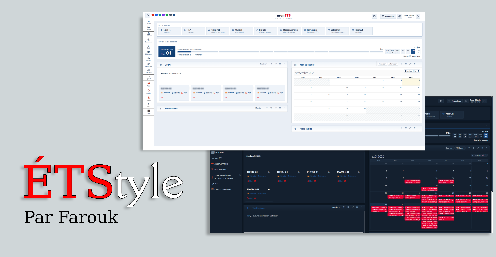
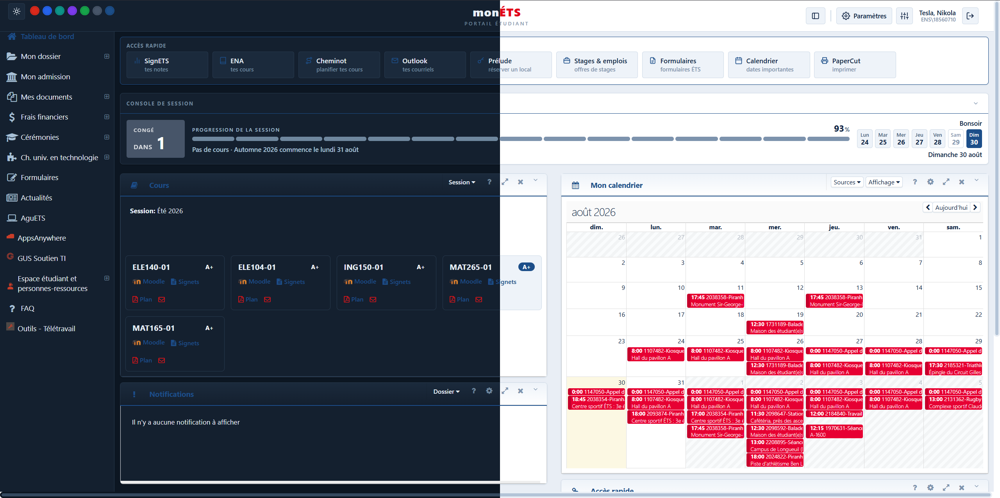
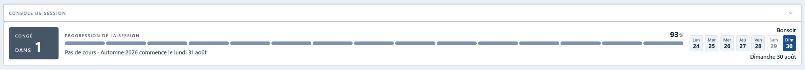

**ETStyle** est une extension de navigateur pour **portail.etsmtl.ca** et **signets-ens.etsmtl.ca**, le portail étudiant et le système de notes de l'ÉTS. Elle refait l'interface des deux sites, ajoute une console de session calée sur le vrai calendrier universitaire, et enrichit SignETS avec des notes colorées, des graphiques et un simulateur de moyenne.

Tout tourne dans le navigateur : aucune donnée n'est envoyée à un serveur autre que ceux de l'ÉTS déjà utilisés par les pages elles-mêmes.

## Le portail

L'en-tête, le menu de gauche et les blocs natifs sont réhabillés avec un système de thème cohérent, en clair comme en sombre.

La console de session en haut de page suit le calendrier universitaire officiel de l'ÉTS plutôt qu'une estimation : elle sait distinguer une semaine de cours, une semaine de relâche, une période d'examens et un congé, avec les bonnes dates de reprise.

