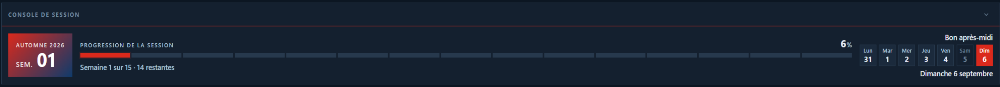
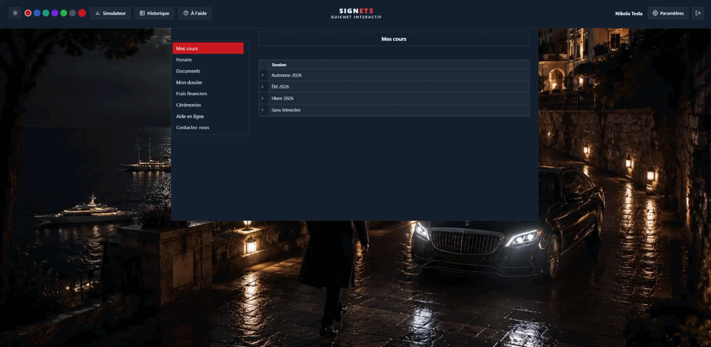

**ETStyle** est une extension de navigateur pour **portail.etsmtl.ca** et **signets-ens.etsmtl.ca**, le portail étudiant et le système de notes de l'ÉTS. Elle refait l'interface des deux sites, ajoute une console de session calée sur le vrai calendrier universitaire, et enrichit SignETS avec des graphiques et un simulateur de moyenne.

Tout tourne dans le navigateur : aucune donnée n'est envoyée à un serveur autre que ceux de l'ÉTS déjà utilisés par les pages elles-mêmes.


## Table des matières

- [Le portail](#le-portail)
- [SignETS](#signets)
- [Thèmes](#thèmes)
- [Fond d'écran personnalisé](#fond-décran-personnalisé)
- [Installation en local](#installation-en-local)
- [Confidentialité](#confidentialité)
- [Remerciements](#remerciements)
- [Licence](#licence)
- [À propos](#à-propos)
- [Avertissement](#avertissement)

## Le portail

L'en-tête, le menu de gauche et les blocs natifs sont réhabillés avec un système de thème cohérent, en clair comme en sombre.


La console de session en haut de page suit le calendrier universitaire officiel de l'ÉTS plutôt qu'une estimation : elle sait distinguer une semaine de cours, une semaine de relâche, une période d'examens et un congé, avec les bonnes dates de reprise.





La barre de raccourcis ne garde que les sites officiels de l'ÉTS.


## SignETS

La cote estimée et le rang centile sont ajoutés directement dans le tableau des cours, avec l'écart à la moyenne du groupe pour chaque évaluation.


Le graphique d'évolution retrace la cote cumulative session par session, avec une ligne distincte par programme pour les étudiants qui en ont suivi plusieurs.

La distribution estimée des notes du groupe se lit en histogramme ou en courbe, avec la position de l'étudiant marquée dessus.

Le simulateur de moyenne calcule la cote requise aux évaluations restantes pour atteindre un objectif, session par session.


L'historique des cours réunit tous les cours suivis dans un seul tableau, triable par cote, par sigle ou par titre, avec un filtre par programme (le programme actif est détecté automatiquement).


## Thèmes

Quatre thèmes, chacun avec une version claire et une version sombre, synchronisés entre le portail et SignETS.

| Mode Clair                                                                               | Mode Sombre                                                                               |
| --------------------------------------------------------------------------------------- | ---------------------------------------------------------------------------------------- |
 |  |


L'accent de couleur, la police et plusieurs options d'affichage se règlent depuis le panneau des paramètres.

## Fond d'écran personnalisé

Les deux sites acceptent une image de fond, à choisir dans **Paramètres**, sous **Paramètres avancés**. Deux façons de faire :

- **Coller une adresse d'image** dans le champ, puis **Appliquer**. L'image est chargée depuis son site d'origine, rien n'est copié localement.
- **Choisir un fichier** sur l'ordinateur avec le bouton **Fichier**. L'image est réduite à 1920 pixels de large avant d'être gardée, ce qui permet d'utiliser une photo de plusieurs mégaoctets sans dépasser l'espace de stockage du navigateur.

L'image est enregistrée uniquement dans ton navigateur et n'est envoyée nulle part. Le bouton **Retirer** remet le fond d'origine.



## Installation en local

Pour installer le projet depuis le code source plutôt que depuis le Chrome Web Store :

```bash
git clone https://github.com/faroukx/ETStyle.git
```

1. Ouvrir `chrome://extensions`.
2. Activer le **Mode développeur** en haut à droite.
3. Cliquer **Charger l'extension non empaquetée** et choisir le dossier cloné.
4. Se rendre sur `portail.etsmtl.ca` ou `signets-ens.etsmtl.ca`.

## Confidentialité

Les préférences (thème, accent, options d'affichage) sont conservées en local, dans `localStorage` et dans `chrome.storage.sync` pour la synchronisation entre les deux sites. Rien d'autre n'est collecté, et rien n'est envoyé à un serveur tiers. Détails dans [PRIVACY.md](PRIVACY.md).

## Remerciements

L'idée des graphiques « Évolution de votre moyenne » et « Distribution estimée des notes » vient de [SignETS Plugin](https://github.com/hadi4172/signets-plugin), une extension antérieure pour ce même site, créée par Hadi Yahia ([hadi4172](https://github.com/hadi4172)) et ses contributeurs. Le code d'ETStyle est écrit indépendamment, sans reprendre le code source de ce projet.

## Licence

Ce projet est distribué sous licence [MIT](LICENSE).

Il utilise [Chart.js](https://www.chartjs.org/) et [chartjs-plugin-annotation](https://github.com/chartjs/Chart.Annotation.js), tous deux sous licence MIT, inclus dans `vendors/chartjs/`.

## À propos

Développé par **Saad Farouk**
[GitHub](https://github.com/faroukx) · [LinkedIn](https://www.linkedin.com/in/farouks/)

Dépôt du projet : [github.com/faroukx/ETStyle](https://github.com/faroukx/ETStyle)

ETStyle est un projet personnel, développé de façon indépendante et sans lien officiel avec l'École de technologie supérieure : l'ÉTS ne l'a ni revu, ni approuvé, ni financé.

## Avertissement

ETStyle modifie l'apparence et le comportement de pages qui ne sont pas sous son contrôle : une mise à jour du portail ou de SignETS peut casser une fonctionnalité sans préavis.
