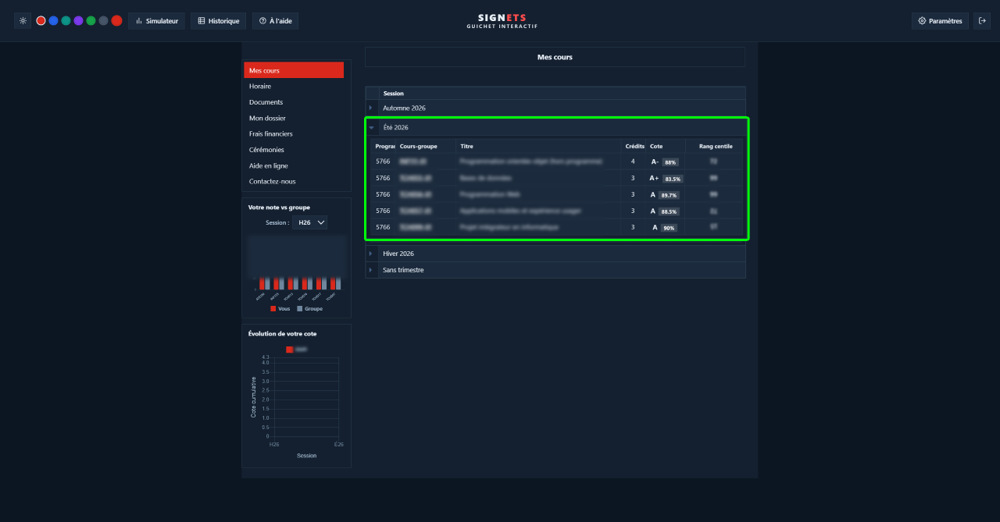
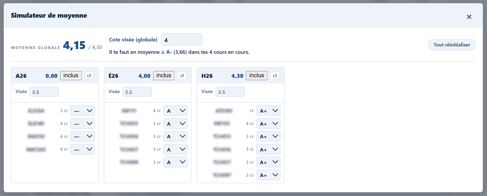
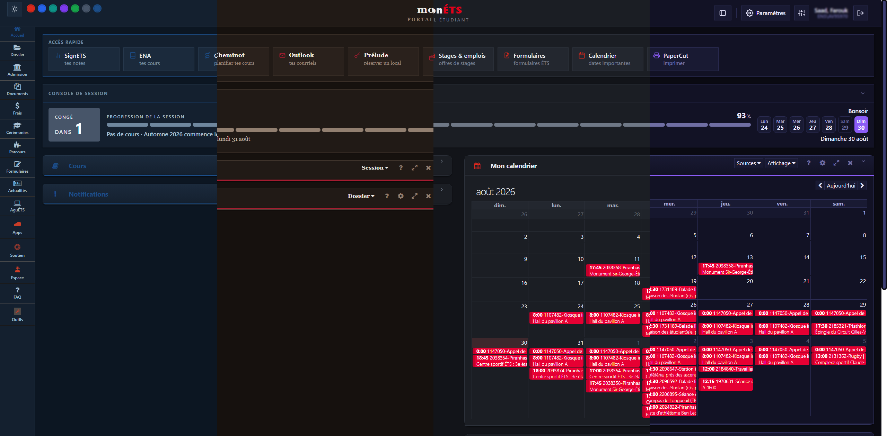
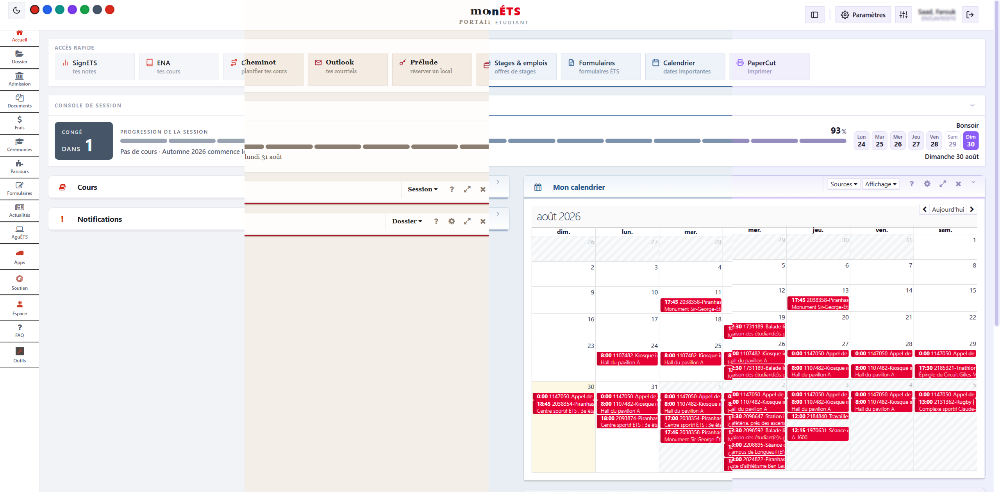

**ETStyle** est une extension de navigateur pour **portail.etsmtl.ca** et **signets-ens.etsmtl.ca**, le portail étudiant et le système de notes de l'ÉTS. Elle refait l'interface des deux sites, ajoute une console de session calée sur le vrai calendrier universitaire, et enrichit SignETS avec des notes colorées, des graphiques et un simulateur de moyenne.

Tout tourne dans le navigateur : aucune donnée n'est envoyée à un serveur autre que ceux de l'ÉTS déjà utilisés par les pages elles-mêmes.

## Le portail

L'en-tête, le menu de gauche et les blocs natifs sont réhabillés avec un système de thème cohérent, en clair comme en sombre.

La console de session en haut de page suit le calendrier universitaire officiel de l'ÉTS plutôt qu'une estimation : elle sait distinguer une semaine de cours, une semaine de relâche, une période d'examens et un congé, avec les bonnes dates de reprise.

La barre de raccourcis ne garde que les sites officiels de l'ÉTS.

## SignETS

Chaque note est colorée selon son écart à la moyenne du groupe, avec la cote estimée et le rang centile ajoutés directement dans le tableau des cours.

Le graphique d'évolution retrace la cote cumulative session par session, avec une ligne distincte par programme pour les étudiants qui en ont suivi plusieurs.

La distribution estimée des notes du groupe se lit en histogramme ou en courbe, avec la position de l'étudiant marquée dessus.

Le simulateur de moyenne calcule la cote requise aux évaluations restantes pour atteindre un objectif, session par session.

## Thèmes

Quatre thèmes, chacun avec une version claire et une version sombre, synchronisés entre le portail et SignETS.

L'accent de couleur, la police et plusieurs options d'affichage se règlent depuis le panneau des paramètres.

